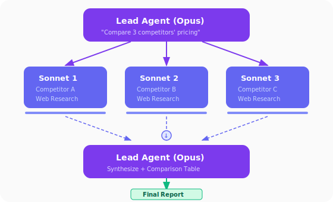

# 에이전트 워크플로우 실전

## 이 강의의 목표

앞선 강의에서 에이전트 팀의 개념과 패턴, OpenClaw의 아키텍처를 배웠습니다. 이제 **실제로 에이전트 기반 워크플로우를 설계하고 실행**하는 방법을 실습합니다.

## Claude Agent SDK

Anthropic의 **Claude Agent SDK**는 Claude Code의 핵심 기능을 프로그래밍 가능한 라이브러리로 제공합니다. Python과 TypeScript 모두 지원합니다.

### 설치

```bash
# TypeScript
npm install @anthropic-ai/claude-agent-sdk

# Python
pip install claude-agent-sdk
```

### 기본 사용법

```python
import asyncio
from claude_agent_sdk import query, ClaudeAgentOptions

async def main():
    async for message in query(
        prompt="auth.py의 버그를 찾아서 수정해줘",
        options=ClaudeAgentOptions(
            allowed_tools=["Read", "Edit", "Bash"]
        ),
    ):
        if hasattr(message, "result"):
            print(message.result)

asyncio.run(main())
```

```typescript
import { query } from "@anthropic-ai/claude-agent-sdk";

for await (const message of query({
  prompt: "auth.py의 버그를 찾아서 수정해줘",
  options: { allowedTools: ["Read", "Edit", "Bash"] }
})) {
  if ("result" in message) console.log(message.result);
}
```

핵심 차이: Anthropic Client SDK는 도구 실행 루프를 **직접 구현**해야 하지만, Agent SDK는 Claude가 **자율적으로** 도구를 선택하고 실행합니다.

### Sub-Agent 정의

Agent SDK에서 커스텀 에이전트를 정의하고 위임할 수 있습니다:

```python
from claude_agent_sdk import query, ClaudeAgentOptions, AgentDefinition

async def main():
    async for message in query(
        prompt="code-reviewer 에이전트로 이 코드를 리뷰해줘",
        options=ClaudeAgentOptions(
            allowed_tools=["Read", "Glob", "Grep", "Agent"],
            agents={
                "code-reviewer": AgentDefinition(
                    description="코드 품질과 보안 리뷰 전문가",
                    prompt="코드 품질을 분석하고 개선안을 제시하세요.",
                    tools=["Read", "Glob", "Grep"],
                )
            },
        ),
    ):
        if hasattr(message, "result"):
            print(message.result)
```

### Hooks — 에이전트 행동 제어

Hooks를 사용하면 에이전트의 주요 시점에 커스텀 로직을 삽입할 수 있습니다:

```python
from claude_agent_sdk import query, ClaudeAgentOptions, HookMatcher

async def log_file_change(input_data, tool_use_id, context):
    file_path = input_data.get("tool_input", {}).get("file_path", "unknown")
    with open("./audit.log", "a") as f:
        f.write(f"파일 수정: {file_path}\n")
    return {}

async def main():
    async for message in query(
        prompt="utils.py를 리팩토링해줘",
        options=ClaudeAgentOptions(
            permission_mode="acceptEdits",
            hooks={
                "PostToolUse": [
                    HookMatcher(
                        matcher="Edit|Write",
                        hooks=[log_file_change]
                    )
                ]
            },
        ),
    ):
        if hasattr(message, "result"):
            print(message.result)
```

사용 가능한 Hook 시점: `PreToolUse`, `PostToolUse`, `Stop`, `SessionStart`, `SessionEnd`, `UserPromptSubmit`

## 실전 워크플로우 패턴

### 패턴 1: 리서치 → 요약 파이프라인

```
┌──────────────────────────────────────────────┐
│  Lead Agent (Opus)                            │
│  "경쟁사 3곳의 가격 정책을 비교 분석해줘"       │
└──┬────────────┬────────────┬─────────────────┘
   ↓            ↓            ↓
┌────────┐  ┌────────┐  ┌────────┐
│Sonnet 1│  │Sonnet 2│  │Sonnet 3│
│경쟁사 A│  │경쟁사 B│  │경쟁사 C│
│웹 리서치│  │웹 리서치│  │웹 리서치│
└────┬───┘  └────┬───┘  └────┬───┘
     ↓           ↓           ↓
     └───────────┼───────────┘
                 ↓
         ┌──────────────┐
         │  Lead Agent   │
         │  결과 종합     │
         │  비교표 생성   │
         └──────────────┘
```



Claude Code에서 실행:

```
3곳의 경쟁사(A사, B사, C사) 가격 정책을 비교 분석해줘.
각 경쟁사를 병렬로 리서치하고, 결과를 비교표로 정리해줘.
Sub-Agent를 사용해서 각각 독립적으로 조사해.
```

### 패턴 2: Agent Team으로 기능 개발

```
에이전트 팀을 만들어서 사용자 인증 모듈을 개발해줘:
- Frontend 담당: React 로그인/회원가입 컴포넌트
- Backend 담당: Express JWT 인증 API
- Test 담당: 프론트+백 통합 테스트
각자 개발하고, 완료 후 통합해줘.
```

이 경우 Agent Team이 Sub-Agent보다 적합합니다. 프론트엔드 팀원이 백엔드 API 스펙을 확인해야 하는 등 **팀원 간 커뮤니케이션**이 필요하기 때문입니다.

### 패턴 3: Human-in-the-Loop + Agent Team

```
보안 감사를 에이전트 팀으로 진행해줘:

Phase 1 (자동):
- 코드 스캔 팀원 3명이 각각 OWASP Top 10 카테고리 분담

Phase 2 (사람 확인):
- 발견된 취약점 목록을 보여주고 내 확인을 받아

Phase 3 (자동):
- 확인된 취약점에 대해 수정 코드 작성

각 Phase 전환 시 반드시 내 승인을 받아.
```

### 패턴 4: OpenClaw + Claude Code 연동

Slack에서 트리거 → OpenClaw이 Claude Code를 호출 → 결과를 Slack에 게시:

```yaml
# OpenClaw SOUL.md
이름: CodeReview Bot
역할: Slack에서 코드 리뷰 요청을 처리하는 에이전트

트리거:
  - Slack 메시지에 "리뷰해줘" 포함 시

워크플로우:
  1. PR 번호를 메시지에서 추출
  2. GitHub에서 PR diff 가져오기
  3. Claude Code로 코드 리뷰 실행
  4. 리뷰 결과를 Slack 스레드에 게시
```

## 비용 최적화 전략

멀티 에이전트 시스템은 토큰 사용량이 크게 증가합니다. 최적화 방법:

| 전략 | 설명 | 절감 효과 |
|---|---|---|
| **모델 계층화** | Lead=Opus, Workers=Sonnet/Haiku | 비용 50~70% 감소 |
| **작업 필터링** | 단순 작업은 에이전트 없이 직접 처리 | 불필요한 에이전트 생성 방지 |
| **컨텍스트 관리** | 외부 메모리에 중간 결과 저장 | 토큰 한도 초과 방지 |
| **팀 규모 최적화** | 3~5명 시작, 필요시 확장 | 조율 오버헤드 최소화 |

Anthropic의 데이터에 따르면 멀티 에이전트 시스템은 단일 에이전트보다 약 15배 더 많은 토큰을 사용합니다. 하지만 복잡한 리서치 작업에서는 90%의 시간 단축이 이 비용을 정당화합니다.

## Agent SDK vs Claude Code CLI

| 사용 사례 | 추천 도구 |
|---|---|
| 인터랙티브 개발 | CLI |
| CI/CD 파이프라인 | SDK |
| 커스텀 애플리케이션 | SDK |
| 일회성 작업 | CLI |
| 프로덕션 자동화 | SDK |

많은 팀이 두 가지를 함께 사용합니다: 일상 개발은 CLI로, 프로덕션 자동화는 SDK로.

## 실습 과제

### 과제 1: Sub-Agent 리서치 파이프라인

Claude Code에서 다음을 실행해보세요:

```
우리 프로젝트(practice/)의 데이터 파일들을 분석해줘.
Sub-Agent를 활용해서:
1. Agent 1: 데이터 파일 구조 분석
2. Agent 2: 데이터 품질 검증 (누락값, 이상치)
3. Agent 3: 개선 제안서 작성
3개를 병렬로 실행하고 결과를 종합해줘.
```

### 과제 2: Agent Team PR 리뷰

(Agent Team 활성화 필요)

```
practice/ 폴더의 코드를 에이전트 팀으로 리뷰해줘.
팀원 구성:
- 코드 품질 리뷰어
- 보안 검토자
- 성능 분석가
서로 발견한 이슈를 공유하고 토론해줘.
```

### 과제 3: Claude Agent SDK 활용

Python 환경에서:

```python
# 1. SDK 설치
# pip install claude-agent-sdk

# 2. 아래 코드를 agent_demo.py로 저장
import asyncio
from claude_agent_sdk import query, ClaudeAgentOptions

async def main():
    async for message in query(
        prompt="현재 디렉토리의 파일을 분석하고 README.md를 작성해줘",
        options=ClaudeAgentOptions(
            allowed_tools=["Read", "Write", "Glob", "Grep", "Bash"]
        ),
    ):
        if hasattr(message, "result"):
            print(message.result)

asyncio.run(main())

# 3. 실행: python agent_demo.py
```

## 핵심 정리

```
에이전트 워크플로우 선택 가이드:

단순 작업 (1명이면 충분)
  → 단일 Claude Code 세션

병렬 독립 작업 (결과만 필요)
  → Sub-Agent

협업이 필요한 복잡 작업
  → Agent Team

프로덕션 자동화
  → Claude Agent SDK

멀티 채널 자동화
  → OpenClaw

비용이 중요한 환경
  → 모델 계층화 (Opus/Sonnet/Haiku)
```


> 참조:
> - [Claude Agent SDK 공식 문서](https://platform.claude.com/docs/en/agent-sdk/overview)
> - [Claude Code Agent Teams](https://code.claude.com/docs/en/agent-teams)
> - [Anthropic — Multi-Agent Research System](https://www.anthropic.com/engineering/multi-agent-research-system)
> - [Agent Teams with Claude Code and Claude Agent SDK — Medium](https://kargarisaac.medium.com/agent-teams-with-claude-code-and-claude-agent-sdk-e7de4e0cb03e)
