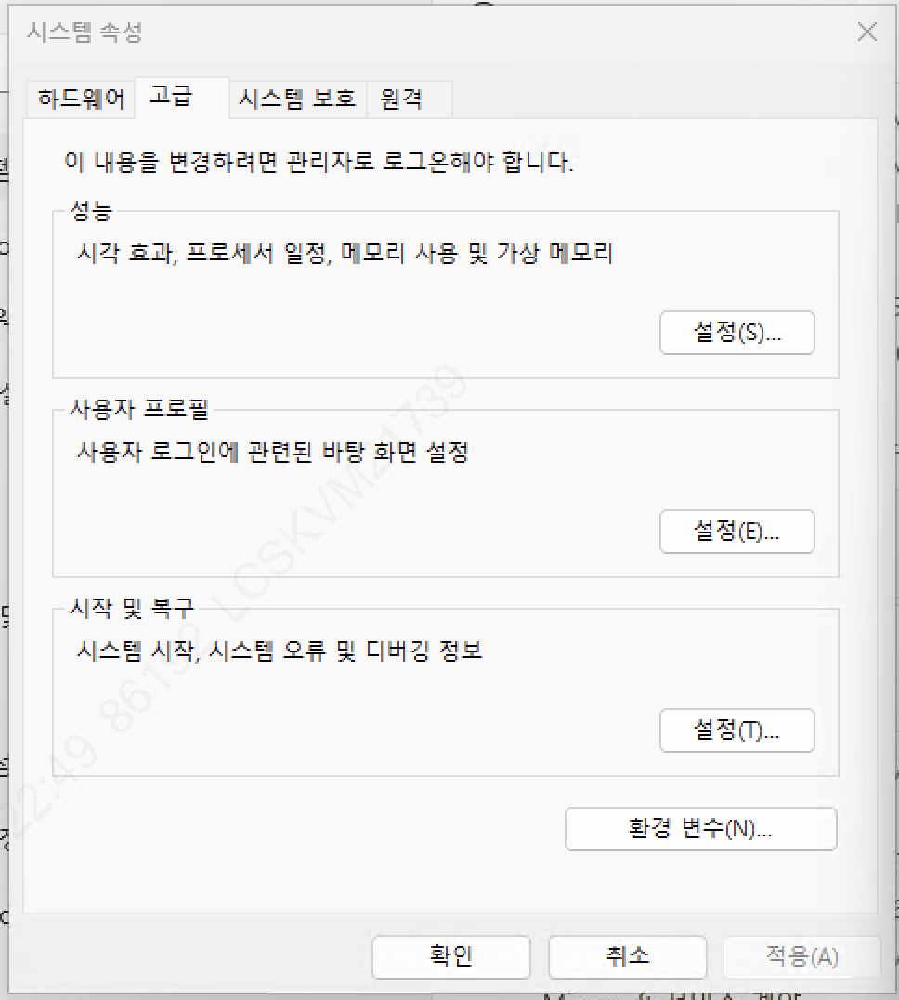
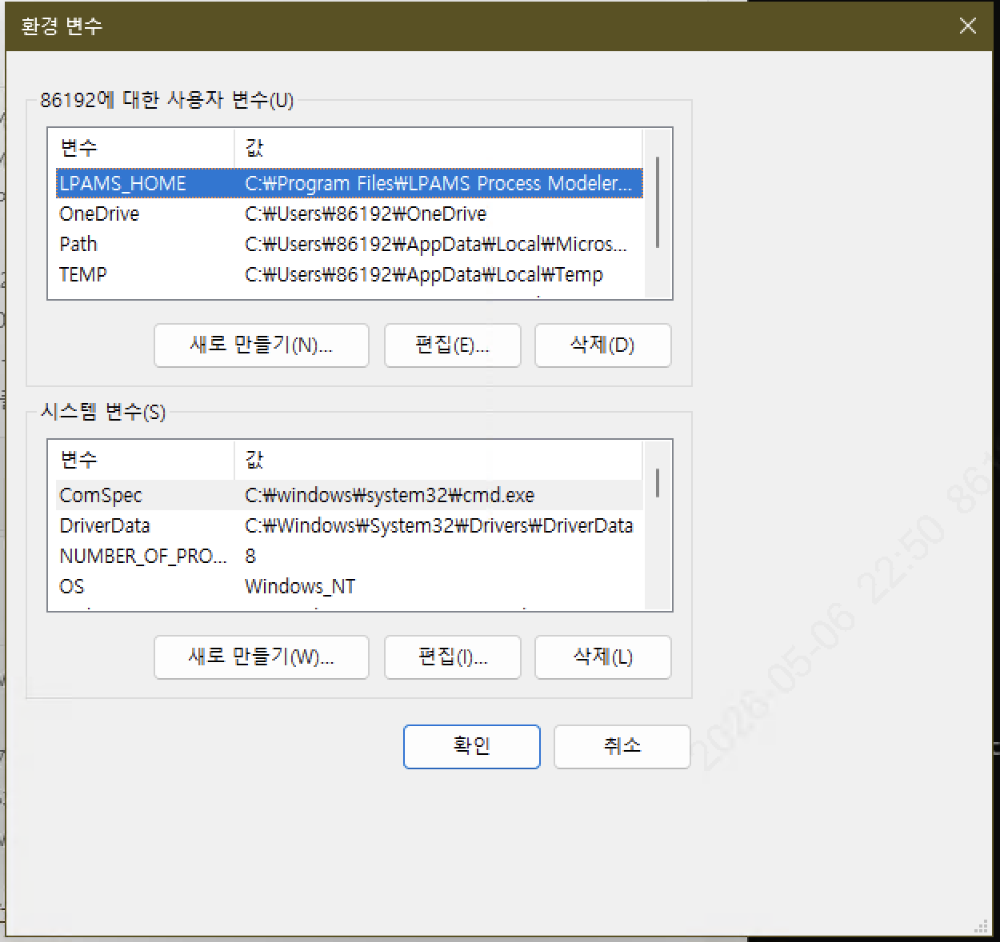
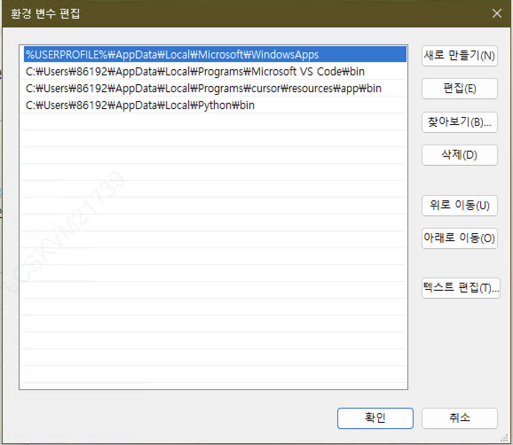
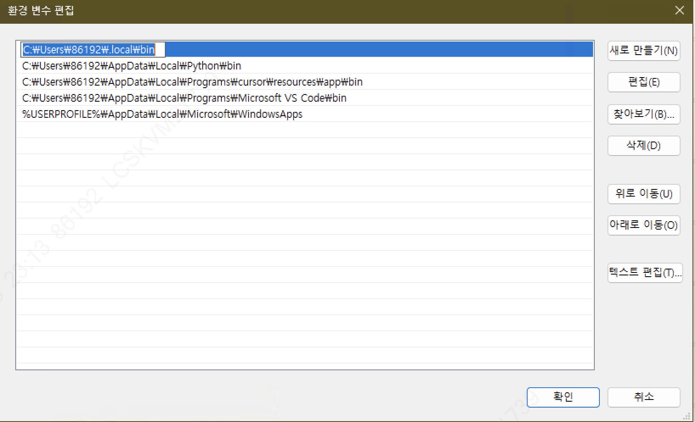
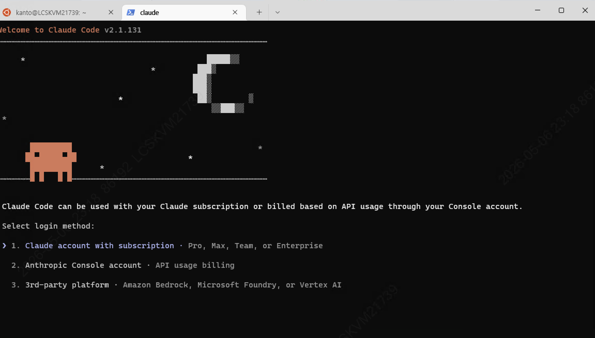

# Windows에서 Claude Code 설치하기 (PowerShell 기준)

Mac/Linux와 달리 Windows에서는 **PATH 설정**에서 막히는 경우가 많습니다.
이 챕터는 PowerShell에서 `claude` 명령이 인식되지 않을 때 PATH를 직접 추가하는 방법을 그림과 함께 안내합니다.

---

## 1. 사전 준비

### PowerShell 버전 확인

```powershell
$PSVersionTable.PSVersion
```

PowerShell 5.1 또는 7.x 모두 가능합니다.

> Claude Code 네이티브 설치는 Node.js / npm을 요구하지 않습니다. 별도 런타임 설치 없이 진행 가능합니다.

---

## 2. Claude Code 설치 (네이티브 설치 스크립트)

PowerShell에서:

```powershell
irm https://claude.ai/install.ps1 | iex
```

설치 스크립트가 `claude.exe`를 다음 경로에 배치합니다:

```
C:\Users\<사용자명>\.local\bin\claude.exe
```

설치 직후 확인:

```powershell
claude --version
```

✅ 버전이 출력되면 → **3장은 건너뛰고 4장(첫 실행)으로 이동**
❌ `claude : 용어가 인식되지 않습니다` 오류 → **3장(PATH 추가)으로 진행**

---

## 3. PATH 환경 변수에 `.local\bin` 경로 추가하기

설치 스크립트가 PATH 등록까지 자동으로 처리하지 못한 경우, 직접 등록해야 합니다. 추가할 경로:

```
C:\Users\<사용자명>\.local\bin
```

`<사용자명>` 자리에는 본인 Windows 계정명을 넣습니다. PowerShell에서 다음으로 확인 가능:

```powershell
echo $env:USERNAME
# 또는 실제 파일 존재 확인
Test-Path "$env:USERPROFILE\.local\bin\claude.exe"
```

`True`가 반환되면 파일은 정상 설치된 것이고, PATH만 추가하면 됩니다.

---

### 단계 1 — 시스템 속성 → 환경 변수

`Win + R` → `sysdm.cpl` 입력 → Enter
또는 시작 메뉴에서 "**시스템 환경 변수 편집**" 검색.

**고급** 탭으로 이동한 뒤 우측 하단 **환경 변수(N)...** 버튼 클릭.



---

### 단계 2 — 사용자 변수의 Path 선택

상단 "사용자 변수" 영역에서 **`Path`** 항목을 클릭해 선택한 뒤 **편집(E)...** 버튼 클릭.

> 시스템 변수가 아닌 **사용자 변수**의 Path를 수정합니다. 관리자 권한 없이 본인 계정에만 적용되어 안전합니다.



---

### 단계 3 — Path 편집 창 열기

기존 Path 항목들이 한 줄씩 나열됩니다. 우측 **새로 만들기(N)** 클릭.



---

### 단계 4 — `.local\bin` 경로 추가

새로운 빈 줄에 Claude Code가 설치된 경로를 붙여넣습니다:

```
C:\Users\<사용자명>\.local\bin
```

예: 사용자명이 `86192`라면 `C:\Users\86192\.local\bin`.

입력 후 **확인**을 차례로 눌러 모든 창을 닫습니다.



> 위 스크린샷의 첫 줄(`C:\Users\86192\.local\bin`)이 방금 추가한 항목입니다.

---

## 4. PowerShell 재시작 — 잊지 마세요!

> ⚠ **PATH 변경은 새 PowerShell 세션부터 적용됩니다.**

현재 열려 있는 PowerShell 창을 **모두 닫고 새로 여세요**. (탭 교체가 아니라 창 자체를 닫아야 합니다.)

새 창에서 확인:

```powershell
claude --version
```

이번에는 버전이 출력되어야 합니다.

---

## 5. 첫 실행 — Claude 구독 로그인

```powershell
cd C:\path\to\your-project
claude
```

처음 실행하면 **구독 로그인 화면**이 뜹니다.

### 정상 화면인 경우

아래와 같이 `Welcome to Claude Code` 배너와 로그인 방식 3가지가 보이면 설치가 정상적으로 완료된 것입니다.



```
Welcome to Claude Code v2.1.131

Claude Code can be used with your Claude subscription
or billed based on API usage through your Console account.

Select login method:

> 1. Claude account with subscription · Pro, Max, Team, or Enterprise
  2. Anthropic Console account · API usage billing
  3. 3rd-party platform · Amazon Bedrock, Microsoft Foundry, or Vertex AI
```

- **1번 (Claude subscription)** 선택 → 브라우저가 열리고 claude.ai 계정 로그인 → 권한 승인 → 터미널로 자동 복귀
- **2번 (Anthropic Console)** — API 키 사용자는 이 옵션 선택 후 키 붙여넣기
- **3번 (3rd-party)** — 회사가 Bedrock / Foundry / Vertex AI 게이트웨이를 쓸 때만

로그인이 끝나면 다음과 같은 프롬프트가 보입니다:

```
> Welcome! Type your message...
```

이 시점에서 `안녕!` 정도 입력해 응답이 오는지 확인하면 설치 검증 완료입니다.

---

## 자주 막히는 지점 정리

| 증상 | 원인 | 해결 |
|---|---|---|
| `claude : 용어가 인식되지 않습니다` | PATH 미등록 | 3장 단계 1~4 |
| PATH 추가했는데 여전히 인식 안 됨 | PowerShell 재시작 안 함 | 창을 모두 닫고 새 창 열기 |
| `Test-Path` 결과 `False` | 설치 스크립트 실패 | 2장 설치 명령 재실행 |
| 권한 오류로 스크립트 차단 | 실행 정책 제한 | `Set-ExecutionPolicy -Scope CurrentUser RemoteSigned` 후 재시도 |
| 로그인 화면이 안 뜸 | 이미 로그인됨 | `claude /logout` 후 재실행 |

---

## 참고: 영구 적용을 PowerShell 명령으로

GUI 대신 PowerShell 1줄로 PATH를 추가할 수도 있습니다(같은 결과).

```powershell
$claudePath = "$env:USERPROFILE\.local\bin"
[Environment]::SetEnvironmentVariable(
    "Path",
    [Environment]::GetEnvironmentVariable("Path", "User") + ";$claudePath",
    "User"
)
```

실행 후 PowerShell 창을 닫고 다시 열어 `claude --version`으로 확인하세요.

---

## 정리

1. `irm https://claude.ai/install.ps1 | iex` — 네이티브 설치 스크립트 실행
2. `claude --version`이 안 되면 → 사용자 Path에 `%USERPROFILE%\.local\bin` 추가
3. **PowerShell 창을 닫고 새로 열기** (가장 자주 빠뜨리는 단계)
4. `claude` 실행 → 구독 로그인

다음 챕터([시작하기](getting-started.md))에서 본격적인 첫 세션을 시작합니다.
