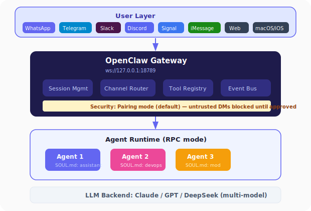
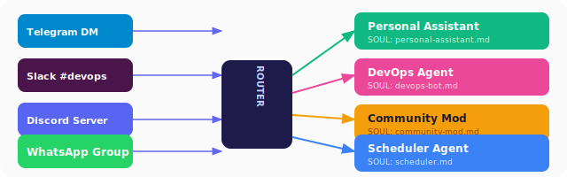
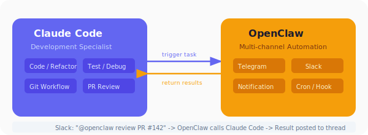

# OpenClaw 에이전트 심화

## 왜 OpenClaw인가?

앞서 [OpenClaw 소개](openclaw-agent/README.md)에서 기본 개념을 살펴보았습니다. 이 강의에서는 OpenClaw의 **에이전트 시스템 아키텍처**와 **실전 활용**을 깊이 다룹니다.

OpenClaw은 2025년 11월 첫 공개 후 60일 만에 GitHub 스타 247,000개를 돌파하며, React(약 10년 소요)보다 빠르게 성장한 오픈소스 프로젝트입니다. 이 폭발적 성장의 이유를 이해하려면 아키텍처를 들여다봐야 합니다.

## 아키텍처 상세

OpenClaw의 핵심은 **WebSocket 기반 Gateway**입니다. 모든 메시징 채널이 Gateway에 연결되고, Gateway가 에이전트 런타임으로 라우팅합니다.

```
┌─────────────────────────────────────────────┐
│              사용자 레이어                     │
│  WhatsApp  Telegram  Slack  Discord  Signal  │
│  iMessage  웹챗  macOS앱  iOS  Android       │
└──────────────┬──────────────────────────────┘
               ↓
┌──────────────────────────────────┐
│     OpenClaw Gateway             │
│     ws://127.0.0.1:18789         │
│                                  │
│  ┌──────────┐  ┌──────────┐     │
│  │ 세션 관리  │  │ 채널 라우팅│     │
│  └──────────┘  └──────────┘     │
│  ┌──────────┐  ┌──────────┐     │
│  │ 툴 레지스트리│  │ 이벤트 버스│     │
│  └──────────┘  └──────────┘     │
└──────────────┬───────────────────┘
               ↓
┌──────────────────────────────────┐
│     에이전트 런타임 (RPC 모드)     │
│                                  │
│  ┌──────┐ ┌──────┐ ┌──────┐    │
│  │Agent1│ │Agent2│ │Agent3│    │
│  └──────┘ └──────┘ └──────┘    │
│                                  │
│  LLM: Claude / GPT / DeepSeek   │
└──────────────────────────────────┘
```



### Gateway의 역할

Gateway는 단순 프록시가 아닙니다. 핵심 역할은:

1. **세션 격리** — 채널·계정별로 에이전트 컨텍스트를 격리
2. **멀티 에이전트 라우팅** — 요청의 종류에 따라 적절한 에이전트로 전달
3. **보안 관문** — 인바운드 DM을 신뢰하지 않음(페어링 모드 기본)
4. **이벤트 조율** — 크론잡, 웹훅, Gmail Pub/Sub 자동화

### 보안 모델

OpenClaw는 인바운드 메시지를 기본적으로 **불신**합니다:

- **페어링 모드(기본)**: 모르는 발신자에게 짧은 코드를 보내고, 승인 후에만 메시지 처리
- **오픈 모드**: 명시적 allowlist로 공개 접근 허용

Nvidia가 2026년 3월 출시한 **NemoClaw**는 기업용 보안 애드온으로, OpenShell 샌드박싱을 통해 에이전트 실행을 격리합니다.

## SOUL.md 심화 — 에이전트 성격 정의

SOUL.md는 Claude Code의 CLAUDE.md에 해당하지만, 더 넓은 범위를 다룹니다:

```markdown
# SOUL.md

## 정체성
이름: DevOps Copilot
역할: 인프라 모니터링 및 자동 대응 에이전트

## 행동 규칙
- 서버 CPU 80% 초과 시 자동 알림
- 디스크 90% 초과 시 로그 정리 스크립트 실행
- 배포 실패 시 자동 롤백 후 팀에 보고

## 도구 권한
허용: 서버 모니터링, 로그 조회, Slack 메시지 발송
금지: 프로덕션 DB 직접 수정, 사용자 데이터 접근

## 커뮤니케이션 스타일
- 기술 용어 사용, 간결하게
- 심각도를 🔴🟡🟢로 표시
- 매 보고에 액션 아이템 포함
```

커뮤니티의 [awesome-openclaw-agents](https://github.com/mergisi/awesome-openclaw-agents)에서 19개 카테고리, 162개 프로덕션 레디 SOUL.md 템플릿을 참고할 수 있습니다.

### SOUL.md vs CLAUDE.md 비교

| 항목 | CLAUDE.md | SOUL.md |
|---|---|---|
| **대상** | 개발 작업 컨텍스트 | 에이전트 전체 성격·행동 |
| **범위** | 프로젝트 규칙, 코딩 컨벤션 | 정체성, 권한, 커뮤니케이션 스타일 |
| **채널** | 터미널/IDE | 메시지 앱 다수 |
| **자동화** | 개발 워크플로우 | 일상 업무, 모니터링, 알림 |
| **사용자** | 개발자 | 개발자 + 비개발자 |

## 멀티 에이전트 라우팅

OpenClaw의 강점 중 하나는 **채널별 에이전트 분리**입니다:

```
Telegram 개인 채팅 → 개인 비서 에이전트 (SOUL: personal-assistant.md)
Slack #devops      → DevOps 에이전트 (SOUL: devops-bot.md)
Discord 서버       → 커뮤니티 관리 에이전트 (SOUL: community-mod.md)
WhatsApp 업무 그룹 → 일정 관리 에이전트 (SOUL: scheduler.md)
```



각 에이전트는 독립된 컨텍스트와 권한을 가집니다. 하나의 Gateway에서 여러 에이전트를 동시에 운영할 수 있습니다.

## Skills Platform

OpenClaw의 스킬 시스템은 세 단계로 구성됩니다:

| 레벨 | 설명 | 예시 |
|---|---|---|
| **Bundled** | OpenClaw 기본 내장 스킬 | 파일 읽기/쓰기, 셸 실행, 웹 검색 |
| **Managed** | 커뮤니티 공유 스킬 (npm 패키지) | Gmail 연동, Jira 티켓 생성, DB 쿼리 |
| **Workspace** | 사용자 커스텀 스킬 | 자사 API 호출, 사내 시스템 연동 |

Claude Code의 Skills와 개념적으로 동일하지만, 메시지 플랫폼에서 실행된다는 점이 다릅니다.

## Claude Code와 OpenClaw 함께 사용하기

두 도구는 경쟁 관계이면서도 상호보완적입니다:

```
┌──────────────────────┐    ┌──────────────────────┐
│     Claude Code      │    │     OpenClaw          │
│  (개발 전문)          │    │  (멀티채널 자동화)     │
│                      │    │                      │
│  코드 작성/리팩토링   │←──→│  Telegram/Slack에서   │
│  테스트/디버깅        │    │  개발 작업 트리거      │
│  Git 워크플로우       │    │  결과 알림 전송       │
└──────────────────────┘    └──────────────────────┘
```



**사용 시나리오:**

1. Slack에서 `@openclaw PR #142 리뷰해줘` 메시지
2. OpenClaw이 Claude Code를 백엔드로 호출하여 코드 리뷰 수행
3. 결과를 Slack 스레드에 자동 게시

## OpenClaw-RL: 대화로 에이전트 훈련하기

2026년 3월 arXiv에 공개된 OpenClaw-RL 논문은 "대화만으로 에이전트를 훈련"하는 방법을 제시합니다. 사용자가 에이전트에게 피드백을 주면, 이를 강화학습 신호로 사용하여 에이전트 행동을 개선하는 접근입니다.

## 실습 준비

```bash
# 설치
npm install -g openclaw@latest
openclaw onboard --install-daemon

# 또는 Docker로 실행
docker run -it --rm \
  -e ANTHROPIC_API_KEY=your_key \
  openclaw/openclaw
```

Node 24 (권장) 또는 Node 22.16+ 필요.

온보딩 마법사가 Gateway, 워크스페이스, 채널, 스킬을 순서대로 안내합니다.

## 핵심 정리

| 관점 | Claude Code | OpenClaw |
|---|---|---|
| **"어디서"** | 터미널/IDE | 어디서든 (30+ 메시지 플랫폼) |
| **"무엇을"** | 코드 중심 작업 | 범용 자동화 |
| **"어떻게"** | Anthropic 인프라 | 로컬 Gateway + 멀티 LLM |
| **에이전트 정의** | CLAUDE.md + Agent 정의 파일 | SOUL.md |
| **팀 협업** | Agent Teams (실험적) | 채널별 에이전트 라우팅 |
| **비용** | API 사용량 기반 | 자체 호스팅 + 선택한 LLM 비용 |

> 참조:
> - [GitHub — openclaw/openclaw](https://github.com/openclaw/openclaw)
> - [OpenClaw 공식 문서](https://docs.openclaw.ai)
> - [OpenClaw-RL 논문 (arXiv)](https://arxiv.org/pdf/2603.10165)
> - [awesome-openclaw-agents](https://github.com/mergisi/awesome-openclaw-agents)
> - [NemoClaw — Nvidia 보안 애드온](https://gurusup.com/blog/best-multi-agent-frameworks-2026)
