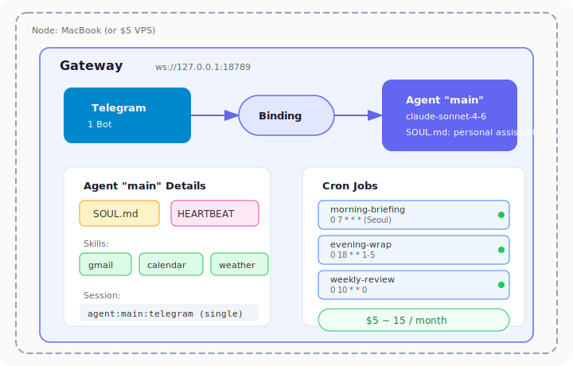
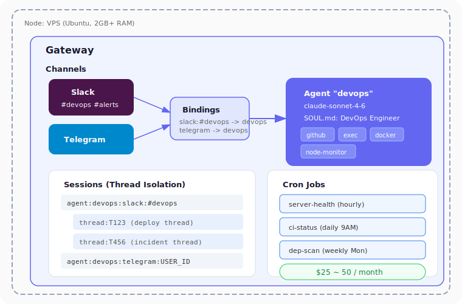
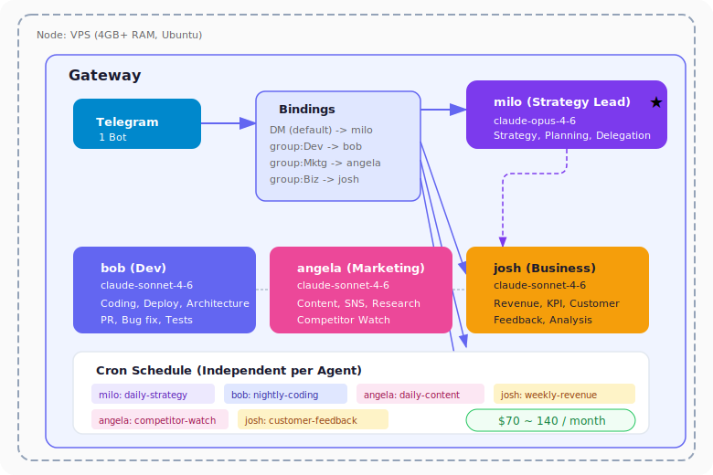
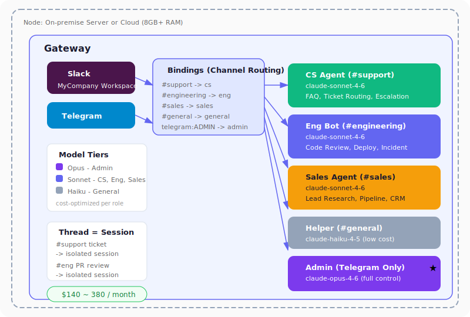

# OpenClaw 실전 구성 패턴 4가지

## 먼저 알아야 할 핵심 개념

OpenClaw의 설정은 `~/.openclaw/openclaw.json` 하나로 관리됩니다. 이 파일 안에 다섯 가지 핵심 개념이 들어 있습니다:

| 개념 | 설명 |
|---|---|
| **Agent** | 독립된 "뇌" 하나. 자체 워크스페이스(SOUL.md, 메모리, 도구)를 가짐 |
| **Channel** | 메시지가 들어오는 경로 (Telegram, Slack, WhatsApp, Discord 등) |
| **Binding** | "이 채널의 이 사람/그룹 → 이 에이전트로 보내라"는 라우팅 규칙 |
| **Session** | 에이전트와 사용자 사이의 대화 맥락. 채널·스레드별로 자동 분리 |
| **Node** | Gateway가 실행되는 물리/가상 머신 (맥북, VPS, Docker 컨테이너 등) |

그리고 각 에이전트에는:

| 파일 | 역할 |
|---|---|
| **SOUL.md** | 에이전트의 성격, 행동 규칙, 권한 정의 (= Claude Code의 CLAUDE.md) |
| **IDENTITY.md** | 에이전트의 이름, 자아 개념 |
| **USER.md** | 사용자에 대해 에이전트가 알고 있는 정보 |
| **HEARTBEAT.md** | 하트비트 때 점검할 체크리스트 |
| **TOOLS.md** | 사용 가능한 도구 설정 |

### openclaw.json 기본 구조

```json
{
  "agents": {
    "default": "main",
    "list": {
      "main": {
        "name": "Main Agent",
        "model": "claude-sonnet-4-6",
        "workspace": "~/.openclaw/workspace"
      }
    }
  },
  "channels": {
    "telegram": {
      "accounts": {
        "default": { "token": "BOT_TOKEN_HERE" }
      }
    }
  },
  "bindings": []
}
```

이제 이 개념들이 각 패턴에서 어떻게 조합되는지 살펴보겠습니다.

---

## 패턴 1: 개인 비서형

> Telegram 하나에 모든 것을 연결하는 가장 단순한 구조. 대부분의 사용자가 여기서 시작합니다.

### 구성도

```
┌─────────────────────────────────────────────────────┐
│  Node: 맥북 (또는 $5 VPS)                            │
│                                                      │
│  ┌─────────────────────────────────────────────┐    │
│  │  Gateway  ws://127.0.0.1:18789              │    │
│  │                                              │    │
│  │  Channel: Telegram ──→ Binding ──→ Agent    │    │
│  │  (1개 봇)              (기본)       "main"   │    │
│  │                                              │    │
│  │  Agent "main"                                │    │
│  │  ├── Model: claude-sonnet-4-6               │    │
│  │  ├── SOUL.md (개인 비서 성격)                │    │
│  │  ├── HEARTBEAT.md (30분마다 점검)            │    │
│  │  └── Skills: gmail, calendar, weather       │    │
│  │                                              │    │
│  │  Sessions:                                   │    │
│  │  └── agent:main:telegram (단일 세션)         │    │
│  └─────────────────────────────────────────────┘    │
└─────────────────────────────────────────────────────┘
```



### 설정

```json
{
  "agents": {
    "default": "main",
    "list": {
      "main": {
        "name": "Savvy",
        "model": "claude-sonnet-4-6",
        "workspace": "~/.openclaw/workspace"
      }
    }
  },
  "channels": {
    "telegram": {
      "accounts": {
        "default": { "token": "BOT_TOKEN" }
      }
    }
  },
  "bindings": []
}
```

에이전트가 1개이고 binding이 비어 있으면, 모든 메시지가 `default` 에이전트인 `"main"`으로 갑니다.

### SOUL.md

```markdown
# SOUL.md

## 정체성
이름: Savvy
역할: 개인 비서 에이전트

## 행동 규칙
- 한국어로 대화
- 간결하고 실용적으로 답변
- 일정 충돌이 발견되면 즉시 알림
- 이메일은 긴급한 것만 요약

## 권한
허용: 이메일 읽기, 캘린더 조회, 날씨 조회, 웹 검색
금지: 이메일 발송, 파일 삭제, 결제
```

### 크론잡

```bash
# 아침 브리핑
openclaw cron add \
  --name "morning-briefing" \
  --cron "0 7 * * *" \
  --tz "Asia/Seoul" \
  --session isolated \
  --message "오늘의 브리핑을 작성해줘: 이메일 요약, 오늘 일정, 날씨" \
  --announce --channel telegram

# 퇴근 리마인더
openclaw cron add \
  --name "evening-wrap" \
  --cron "0 18 * * 1-5" \
  --session isolated \
  --message "오늘 완료한 일과 내일 할 일을 정리해줘"

# 주간 리포트
openclaw cron add \
  --name "weekly-review" \
  --cron "0 10 * * 0" \
  --session isolated \
  --message "이번 주 이메일, 일정, 완료 태스크를 요약하고 다음 주 주요 일정을 알려줘"
```

### 세션 구조

```
agent:main:telegram:USER_ID     ← 메인 대화 (리액티브)
cron:morning-briefing            ← 격리 세션 (매일 아침 생성·삭제)
cron:evening-wrap                ← 격리 세션
cron:weekly-review               ← 격리 세션 (매주 일요일)
```

격리 세션은 기본 24시간 후 자동 정리됩니다. 메인 대화 세션만 영구 유지됩니다.

### 이 구조로 가능한 작업들

| 카테고리 | 구체적 작업 |
|---|---|
| **이메일** | 인박스 요약, 긴급 메일 알림, 발신자별 필터링, 스레드 요약 |
| **캘린더** | 오늘 일정 알림, 일정 충돌 감지, 미팅 리마인더, 주간 일정 조감 |
| **날씨·교통** | 출근 전 날씨 알림, 우산 필요 여부, 퇴근 경로 혼잡도 |
| **리서치** | 웹 검색, 뉴스 요약, 경쟁사 모니터링, 기술 트렌드 정리 |
| **리마인더** | "금요일에 회식 예약 알려줘", 하트비트로 자동 리마인드 |
| **메모** | 아이디어 기록, 할 일 관리, 메모 검색 |

### 비용

- Node: 맥북(무료) 또는 VPS ($5/월)
- LLM: Anthropic API 가벼운 사용 기준 $5~10/월
- **총 $5~15/월**

---

## 패턴 2: 개발자 DevOps형

> Slack과 Telegram을 분리해서 사용. 팀 채널에서는 DevOps 작업을, 개인 채팅에서는 알림을 받는 구조.

### 구성도

```
┌──────────────────────────────────────────────────────────┐
│  Node: VPS (Ubuntu, 2GB+ RAM)                            │
│                                                           │
│  ┌───────────────────────────────────────────────────┐   │
│  │  Gateway                                           │   │
│  │                                                    │   │
│  │  Channels:                                         │   │
│  │  ├── Slack (#devops, #alerts) ──┐                  │   │
│  │  └── Telegram (개인) ───────────┤                  │   │
│  │                                  ↓                  │   │
│  │  Bindings:                                         │   │
│  │  ├── slack:#devops     → Agent "devops"            │   │
│  │  ├── slack:#alerts     → Agent "devops"            │   │
│  │  └── telegram:개인      → Agent "devops" (기본)    │   │
│  │                                                    │   │
│  │  Agent "devops"                                    │   │
│  │  ├── Model: claude-sonnet-4-6                      │   │
│  │  ├── SOUL.md (DevOps 엔지니어)                     │   │
│  │  ├── Skills: github, exec, docker, node-monitor    │   │
│  │  └── Tools: shell, browser, file I/O               │   │
│  │                                                    │   │
│  │  Sessions:                                         │   │
│  │  ├── agent:devops:slack:#devops       (팀 대화)    │   │
│  │  ├── agent:devops:slack:#devops:thread:T123 (스레드)│   │
│  │  ├── agent:devops:slack:#alerts       (알림 채널)   │   │
│  │  ├── agent:devops:telegram:USER_ID    (개인 대화)   │   │
│  │  └── cron:* (격리 세션들)                           │   │
│  └───────────────────────────────────────────────────┘   │
└──────────────────────────────────────────────────────────┘
```



### 설정

```json
{
  "agents": {
    "default": "devops",
    "list": {
      "devops": {
        "name": "DevOps Bot",
        "model": "claude-sonnet-4-6",
        "workspace": "~/.openclaw/workspaces/devops"
      }
    }
  },
  "channels": {
    "slack": {
      "accounts": {
        "default": {
          "botToken": "xoxb-...",
          "appToken": "xapp-...",
          "teamId": "T01234ABCDE"
        }
      }
    },
    "telegram": {
      "accounts": {
        "default": { "token": "BOT_TOKEN" }
      }
    }
  },
  "bindings": [
    {
      "agentId": "devops",
      "match": { "channel": "slack", "peer": { "kind": "channel", "id": "C_DEVOPS_ID" } }
    },
    {
      "agentId": "devops",
      "match": { "channel": "slack", "peer": { "kind": "channel", "id": "C_ALERTS_ID" } }
    }
  ]
}
```

### SOUL.md

```markdown
# SOUL.md

## 정체성
이름: DevOps Bot
역할: 인프라 모니터링, 배포, 코드 리뷰 자동화 에이전트

## 행동 규칙
- Slack에서는 팀 전체가 보므로 공식적으로 답변
- Telegram에서는 개인이므로 간결하게 답변
- 배포 실패 시 즉시 Telegram으로 개인 알림
- 프로덕션 DB 직접 수정은 절대 금지

## 도구 권한
허용: git, docker, kubectl, npm, 서버 모니터링, 로그 조회
금지: 프로덕션 DB 쓰기, rm -rf, 사용자 데이터 접근

## 커뮤니케이션 스타일
- 심각도를 [CRITICAL] [WARN] [INFO]로 표시
- 매 보고에 액션 아이템 포함
- 코드 블록으로 명령어 제안
```

### 크론잡

```bash
# 매시간 서버 상태 체크
openclaw cron add \
  --name "server-health" \
  --cron "0 * * * *" \
  --session isolated \
  --message "프로덕션 서버 CPU, 메모리, 디스크 사용량을 체크하고 80% 넘는 것만 알려줘" \
  --announce --channel telegram

# 매일 아침 CI/CD 상태
openclaw cron add \
  --name "ci-status" \
  --cron "0 9 * * 1-5" \
  --session isolated \
  --message "GitHub Actions에서 최근 24시간 빌드 상태를 확인하고 실패한 것 요약해줘" \
  --announce --channel slack --to "#devops"

# 주간 의존성 보안 스캔
openclaw cron add \
  --name "dep-scan" \
  --cron "0 10 * * 1" \
  --session isolated \
  --message "npm audit과 Snyk으로 의존성 보안 스캔하고 critical/high 취약점 리포트 작성해줘"

# 매일 오후 6시 PR 리뷰 리마인더
openclaw cron add \
  --name "pr-reminder" \
  --cron "0 18 * * 1-5" \
  --session isolated \
  --message "리뷰 대기 중인 PR 목록과 각각의 대기 시간을 정리해줘" \
  --announce --channel slack --to "#devops"
```

### 세션 구조 — Slack 스레드의 의미

Slack에서 특히 중요한 것이 **스레드 세션 분리**입니다:

```
#devops 채널 메인: agent:devops:slack:C_DEVOPS_ID
  └── 스레드 1: agent:devops:slack:C_DEVOPS_ID:thread:T001
  └── 스레드 2: agent:devops:slack:C_DEVOPS_ID:thread:T002
```

"@bot staging 배포해줘"에 대한 응답이 스레드에서 이어지므로, 다른 대화와 컨텍스트가 섞이지 않습니다.

### 이 구조로 가능한 작업들

| 카테고리 | 구체적 작업 |
|---|---|
| **배포** | `@bot staging 배포해줘` → 배포 스크립트 실행 → 결과 스레드 게시 |
| **모니터링** | 서버 CPU/메모리/디스크 알림, 로그 이상 감지, 에러율 급등 알림 |
| **코드 리뷰** | PR diff 분석, 보안 취약점 스캔, 테스트 커버리지 확인 |
| **장애 대응** | 알림 수신 → 로그 분석 → 근본 원인 추정 → 롤백 명령 제안 |
| **의존성 관리** | 보안 취약점 스캔, 업데이트 가능한 패키지 목록, 호환성 확인 |
| **인프라** | Docker 컨테이너 상태, Kubernetes pod 확인, SSL 인증서 만료 알림 |
| **문서화** | 인시던트 리포트 자동 작성, 배포 이력 정리, 런북 업데이트 |

### 비용

- Node: VPS $10~20/월 (2GB+ RAM 권장)
- LLM: API $15~30/월 (크론잡이 많으므로 개인 비서형보다 높음)
- **총 $25~50/월**

---

## 패턴 3: 1인 창업자 멀티에이전트형

> VPS 하나에 4개 에이전트를 올려서 사실상 4인 팀의 아웃풋을 내는 구조. Telegram 하나로 전체를 지휘합니다.

### 구성도

```
┌──────────────────────────────────────────────────────────┐
│  Node: VPS (4GB+ RAM, Ubuntu)                            │
│                                                           │
│  ┌───────────────────────────────────────────────────┐   │
│  │  Gateway                                           │   │
│  │                                                    │   │
│  │  Channel: Telegram (1개 봇)                        │   │
│  │                                                    │   │
│  │  Bindings:                                         │   │
│  │  ├── telegram (기본)         → Agent "milo" (전략) │   │
│  │  ├── telegram:group:Dev      → Agent "bob"  (개발) │   │
│  │  ├── telegram:group:Marketing→ Agent "angela"(마케)│   │
│  │  └── telegram:group:Biz      → Agent "josh" (비즈) │   │
│  │                                                    │   │
│  │  ┌──────────────────────────────────────────┐     │   │
│  │  │ Agent "milo" (Strategy Lead)              │     │   │
│  │  │ Model: claude-opus-4-6                    │     │   │
│  │  │ SOUL: 전략·기획·조율                       │     │   │
│  │  │ 다른 에이전트에게 태스크 위임              │     │   │
│  │  └──────────────────────────────────────────┘     │   │
│  │  ┌──────────┐  ┌──────────┐  ┌──────────┐        │   │
│  │  │"bob"     │  │"angela"  │  │"josh"    │        │   │
│  │  │Dev Agent │  │Marketing │  │Biz Agent │        │   │
│  │  │Model:    │  │Model:    │  │Model:    │        │   │
│  │  │Sonnet 4.6│  │Sonnet 4.6│  │Sonnet 4.6│        │   │
│  │  │          │  │          │  │          │        │   │
│  │  │코딩·배포  │  │콘텐츠·SNS│  │재무·분석  │        │   │
│  │  │아키텍처  │  │리서치    │  │고객 응대  │        │   │
│  │  └──────────┘  └──────────┘  └──────────┘        │   │
│  └───────────────────────────────────────────────────┘   │
└──────────────────────────────────────────────────────────┘
```



### 설정

```json
{
  "agents": {
    "default": "milo",
    "list": {
      "milo": {
        "name": "Milo",
        "model": "claude-opus-4-6",
        "workspace": "~/.openclaw/workspaces/milo"
      },
      "bob": {
        "name": "Bob",
        "model": "claude-sonnet-4-6",
        "workspace": "~/.openclaw/workspaces/bob"
      },
      "angela": {
        "name": "Angela",
        "model": "claude-sonnet-4-6",
        "workspace": "~/.openclaw/workspaces/angela"
      },
      "josh": {
        "name": "Josh",
        "model": "claude-sonnet-4-6",
        "workspace": "~/.openclaw/workspaces/josh"
      }
    }
  },
  "channels": {
    "telegram": {
      "accounts": {
        "default": { "token": "BOT_TOKEN" }
      }
    }
  },
  "bindings": [
    {
      "agentId": "bob",
      "match": { "channel": "telegram", "peer": { "kind": "group", "id": "DEV_GROUP_ID" } }
    },
    {
      "agentId": "angela",
      "match": { "channel": "telegram", "peer": { "kind": "group", "id": "MARKETING_GROUP_ID" } }
    },
    {
      "agentId": "josh",
      "match": { "channel": "telegram", "peer": { "kind": "group", "id": "BIZ_GROUP_ID" } }
    }
  ]
}
```

핵심 포인트: **전략 에이전트(milo)만 Opus**, 나머지는 Sonnet으로 비용을 절약합니다.

### 모델 계층화 전략

```
┌─────────────────────────────────────────┐
│  Opus 4.6  — 전략 판단, 복잡한 의사결정  │  ← milo (Strategy Lead)
├─────────────────────────────────────────┤
│  Sonnet 4.6 — 실무 작업, 코딩, 분석     │  ← bob, angela, josh
├─────────────────────────────────────────┤
│  Haiku 4.5  — 단순 분류, 요약, 라우팅   │  ← 크론잡 중 단순 작업
└─────────────────────────────────────────┘
```


### 각 에이전트 SOUL.md (핵심만)

**milo (전략):**
```markdown
역할: Strategy Lead. 전체 사업 전략을 관리하고 다른 에이전트에게 태스크를 위임.
행동: 매일 아침 전체 상황을 점검하고 우선순위를 재조정.
금지: 직접 코딩하지 않음. 직접 콘텐츠를 작성하지 않음.
```

**bob (개발):**
```markdown
역할: Dev Agent. 코딩, 아키텍처 설계, 버그 수정, PR 관리.
행동: 이슈가 할당되면 브랜치 생성 → 코딩 → PR 제출.
금지: 프로덕션 직접 배포 (milo 승인 필요).
```

**angela (마케팅):**
```markdown
역할: Marketing Agent. 시장 리서치, 콘텐츠 제작, SNS 관리.
행동: 경쟁사 동향을 모니터링하고 주간 리포트 작성.
금지: 유료 광고 집행. 고객 데이터 직접 접근.
```

**josh (비즈니스):**
```markdown
역할: Business Agent. 재무 분석, 메트릭 추적, 고객 응대.
행동: 매출·비용·KPI를 추적하고 이상치 발견 시 즉시 알림.
금지: 결제 처리. 계약 체결.
```

### 크론잡 — 각 에이전트 독립 스케줄

```bash
# milo: 매일 아침 전체 상황 점검
openclaw cron add --agent milo \
  --name "daily-strategy" \
  --cron "0 8 * * *" \
  --session isolated \
  --message "어제 각 에이전트의 작업 결과를 확인하고 오늘 우선순위를 정리해줘"

# bob: 매일 밤 이슈 처리
openclaw cron add --agent bob \
  --name "nightly-coding" \
  --cron "0 0 * * *" \
  --session isolated \
  --message "GitHub에서 할당된 이슈를 확인하고 가능한 것부터 처리해줘. 각 이슈마다 브랜치를 만들고 PR을 올려"

# angela: 매일 오전 콘텐츠 작성
openclaw cron add --agent angela \
  --name "daily-content" \
  --cron "0 10 * * 1-5" \
  --session isolated \
  --message "오늘의 SNS 콘텐츠를 작성해줘. 트렌드를 반영하고 플랫폼별로 다르게 작성해"

# angela: 매주 수요일 경쟁사 분석
openclaw cron add --agent angela \
  --name "competitor-watch" \
  --cron "0 14 * * 3" \
  --session isolated \
  --message "주요 경쟁사 3곳의 최근 동향을 리서치해줘"

# josh: 매주 금요일 주간 매출 리포트
openclaw cron add --agent josh \
  --name "weekly-revenue" \
  --cron "0 17 * * 5" \
  --session isolated \
  --message "이번 주 매출, 비용, 주요 KPI를 정리하고 지난주 대비 변화를 분석해줘"

# josh: 매일 고객 피드백 모니터링
openclaw cron add --agent josh \
  --name "customer-feedback" \
  --cron "0 11 * * *" \
  --session isolated \
  --message "어제 들어온 고객 피드백과 지원 요청을 요약해줘. 긴급한 것 표시해줘"
```

### 세션 구조

```
# milo (전략) — Telegram DM이 기본 진입점
agent:milo:telegram:USER_ID

# bob (개발) — Telegram 그룹 "Dev"
agent:bob:telegram:DEV_GROUP_ID

# angela (마케팅) — Telegram 그룹 "Marketing"
agent:angela:telegram:MARKETING_GROUP_ID

# josh (비즈니스) — Telegram 그룹 "Biz"
agent:josh:telegram:BIZ_GROUP_ID

# 각 에이전트의 크론 격리 세션
cron:daily-strategy          (milo)
cron:nightly-coding          (bob)
cron:daily-content           (angela)
cron:competitor-watch        (angela)
cron:weekly-revenue          (josh)
cron:customer-feedback       (josh)
```

**에이전트 간 메모리 공유:** 각 에이전트의 워크스페이스는 독립적이지만, 공유 디렉토리를 심볼릭 링크로 연결하면 전략 문서나 KPI를 함께 참조할 수 있습니다.

### 이 구조로 가능한 작업들

| 에이전트 | 구체적 작업 |
|---|---|
| **milo** | 일일 우선순위 설정, 주간 전략 리뷰, 에이전트 간 태스크 조율, OKR 추적 |
| **bob** | 밤새 이슈 처리, PR 생성·리뷰, 버그 수정, 의존성 업데이트, 테스트 작성 |
| **angela** | SNS 콘텐츠 작성·예약, 경쟁사 모니터링, 뉴스레터 초안, SEO 분석 |
| **josh** | 매출 리포트, 고객 피드백 분류, 가격 분석, 이탈 위험 고객 알림, 지출 추적 |

### 비용

- Node: VPS $20~40/월 (4GB+ RAM, 4 에이전트 동시 실행)
- LLM: Opus(milo) + Sonnet×3 ≈ $50~100/월
- **총 $70~140/월** (풀타임 직원 1명 인건비의 1~2%)

---

## 패턴 4: 팀 협업형

> Slack 채널별로 전문 에이전트를 배정하는 조직 구조. 각 팀이 자기 채널에서 자기 에이전트와 일합니다.

### 구성도

```
┌─────────────────────────────────────────────────────────────┐
│  Node: 사내 서버 또는 클라우드 (8GB+ RAM)                      │
│                                                              │
│  ┌──────────────────────────────────────────────────────┐   │
│  │  Gateway                                              │   │
│  │                                                       │   │
│  │  Channels:                                            │   │
│  │  ├── Slack (Socket Mode, Workspace: MyCompany)        │   │
│  │  └── Telegram (관리자 전용)                            │   │
│  │                                                       │   │
│  │  Bindings:                                            │   │
│  │  ├── slack:#support     → Agent "cs"                  │   │
│  │  ├── slack:#engineering → Agent "eng"                 │   │
│  │  ├── slack:#sales       → Agent "sales"               │   │
│  │  ├── slack:#general     → Agent "general"             │   │
│  │  └── telegram:ADMIN_ID  → Agent "admin"               │   │
│  │                                                       │   │
│  │  ┌────────┐ ┌────────┐ ┌────────┐ ┌────────┐        │   │
│  │  │"cs"    │ │"eng"   │ │"sales" │ │"admin" │        │   │
│  │  │CS Agent│ │Eng Bot │ │Sales   │ │Admin   │        │   │
│  │  │        │ │        │ │Agent   │ │Agent   │        │   │
│  │  │Sonnet  │ │Sonnet  │ │Sonnet  │ │Opus    │        │   │
│  │  │        │ │        │ │        │ │        │        │   │
│  │  │고객응대 │ │코드리뷰│ │리드분석│ │전체관리│        │   │
│  │  │FAQ     │ │배포    │ │파이프  │ │모니터링│        │   │
│  │  │에스컬  │ │장애대응│ │라인    │ │설정변경│        │   │
│  │  └────────┘ └────────┘ └────────┘ └────────┘        │   │
│  └──────────────────────────────────────────────────────┘   │
└─────────────────────────────────────────────────────────────┘
```



### 설정

```json
{
  "agents": {
    "default": "general",
    "list": {
      "cs": {
        "name": "CS Agent",
        "model": "claude-sonnet-4-6",
        "workspace": "~/.openclaw/workspaces/cs"
      },
      "eng": {
        "name": "Eng Bot",
        "model": "claude-sonnet-4-6",
        "workspace": "~/.openclaw/workspaces/eng"
      },
      "sales": {
        "name": "Sales Agent",
        "model": "claude-sonnet-4-6",
        "workspace": "~/.openclaw/workspaces/sales"
      },
      "admin": {
        "name": "Admin",
        "model": "claude-opus-4-6",
        "workspace": "~/.openclaw/workspaces/admin"
      },
      "general": {
        "name": "Helper",
        "model": "claude-haiku-4-5",
        "workspace": "~/.openclaw/workspaces/general"
      }
    }
  },
  "channels": {
    "slack": {
      "accounts": {
        "default": {
          "botToken": "xoxb-...",
          "appToken": "xapp-...",
          "teamId": "T_COMPANY_ID"
        }
      }
    },
    "telegram": {
      "accounts": {
        "default": { "token": "ADMIN_BOT_TOKEN" }
      }
    }
  },
  "bindings": [
    {
      "agentId": "cs",
      "match": { "channel": "slack", "peer": { "kind": "channel", "id": "C_SUPPORT" } }
    },
    {
      "agentId": "eng",
      "match": { "channel": "slack", "peer": { "kind": "channel", "id": "C_ENGINEERING" } }
    },
    {
      "agentId": "sales",
      "match": { "channel": "slack", "peer": { "kind": "channel", "id": "C_SALES" } }
    },
    {
      "agentId": "admin",
      "match": { "channel": "telegram", "peer": { "kind": "user", "id": "ADMIN_USER_ID" } }
    }
  ]
}
```

### 모델 계층화

패턴 4에서도 [패턴 3의 모델 계층화 전략](#모델-계층화-전략)과 동일한 원칙을 따릅니다:

```
Opus    → admin (관리자 전용, 복잡한 판단)
Sonnet  → cs, eng, sales (실무 에이전트)
Haiku   → general (#general 채널, 단순 질답)
```

`#general`에 Haiku를 쓰면 "점심 뭐 먹지?" 같은 가벼운 질문에 비용을 낭비하지 않습니다.

### 세션 구조 — 팀 환경의 복잡성

```
# CS Agent — #support 채널
agent:cs:slack:C_SUPPORT                          ← 채널 메인
agent:cs:slack:C_SUPPORT:thread:T_TICKET_001      ← 티켓 스레드
agent:cs:slack:C_SUPPORT:thread:T_TICKET_002      ← 티켓 스레드

# Eng Bot — #engineering 채널
agent:eng:slack:C_ENGINEERING                      ← 채널 메인
agent:eng:slack:C_ENGINEERING:thread:T_PR_142      ← PR 리뷰 스레드
agent:eng:slack:C_ENGINEERING:thread:T_INCIDENT    ← 장애 대응 스레드

# Sales Agent — #sales 채널
agent:sales:slack:C_SALES                          ← 채널 메인
agent:sales:slack:C_SALES:thread:T_LEAD_A          ← 리드 분석 스레드

# Admin — Telegram
agent:admin:telegram:ADMIN_USER_ID                 ← 관리자 전용
```

**스레드 = 세션 격리**입니다. `#support`에서 티켓마다 스레드를 열면, 각 티켓의 대화가 독립된 세션으로 분리됩니다. 고객 A의 문제가 고객 B의 맥락을 오염시키지 않습니다.

### 각 에이전트의 작업 범위

**CS Agent (#support):**

| 작업 | 설명 |
|---|---|
| FAQ 자동 응답 | 자주 묻는 질문에 즉시 답변, 관련 문서 링크 첨부 |
| 티켓 분류 | 문의를 버그/기능요청/질문으로 분류하고 라벨링 |
| 에스컬레이션 | 해결 못 하는 문제를 담당자에게 멘션하여 전달 |
| 고객 감정 분석 | 부정적 감정 감지 시 우선 처리 플래그 |
| 주간 지원 리포트 | 문의 건수, 해결률, 주요 이슈 패턴 요약 |

**Eng Bot (#engineering):**

| 작업 | 설명 |
|---|---|
| PR 코드 리뷰 | `@eng PR #142 리뷰해줘` → diff 분석, 보안·성능 코멘트 |
| 장애 초기 대응 | 알림 수신 → 로그 분석 → 근본 원인 추정 → 스레드에 보고 |
| 배포 트리거 | `@eng staging 배포` → 테스트 → 배포 → 결과 보고 |
| 온콜 지원 | 새벽 알림 시 1차 분석하고 심각하면 담당자 호출 |
| 기술 질답 | "Redis 캐시 TTL 기본값 뭐야?" 같은 팀 내 질문 즉답 |

**Sales Agent (#sales):**

| 작업 | 설명 |
|---|---|
| 리드 리서치 | 신규 리드의 회사·역할·관심사를 웹에서 조사하고 요약 |
| CRM 업데이트 | 미팅 노트에서 핵심 정보 추출 → CRM 업데이트 제안 |
| 이메일 초안 | 맥락에 맞는 팔로업 이메일 작성 |
| 파이프라인 리포트 | 주간 파이프라인 상태, 전환율, 예상 매출 정리 |
| 경쟁사 비교 | 고객이 언급한 경쟁사와의 비교 자료 작성 |

**Admin (Telegram):**

| 작업 | 설명 |
|---|---|
| 전체 상태 모니터링 | 각 에이전트의 세션 수, API 사용량, 에러율 확인 |
| 설정 변경 | 에이전트 모델 변경, 크론잡 추가/수정, 바인딩 조정 |
| 비용 추적 | 일일/주간 API 비용 리포트, 에이전트별 토큰 사용량 |
| 긴급 알림 수신 | 다른 에이전트가 해결 못 한 critical 이슈 에스컬레이션 |

### 비용

- Node: 사내 서버(기존 인프라) 또는 클라우드 $40~80/월
- LLM: Opus(admin) + Sonnet×3 + Haiku(general) ≈ $100~300/월
- **총 $140~380/월** (에이전트 사용 빈도에 따라 크게 변동)

---

## 4가지 패턴 비교 요약

| 항목 | 개인 비서형 | DevOps형 | 1인 창업자형 | 팀 협업형 |
|---|---|---|---|---|
| **에이전트 수** | 1 | 1 | 4 | 5+ |
| **채널** | Telegram | Slack + Telegram | Telegram | Slack + Telegram |
| **모델** | Sonnet | Sonnet | Opus + Sonnet×3 | Opus + Sonnet×3 + Haiku |
| **Node** | 맥북 or $5 VPS | VPS | VPS (4GB+) | 사내 서버 |
| **세션 복잡도** | 단순 (1:1) | 중간 (스레드 분리) | 중간 (그룹별 분리) | 높음 (채널×스레드) |
| **월 비용** | $5~15 | $25~50 | $70~140 | $140~380 |
| **적합한 사용자** | 누구나 | 개인 개발자/소규모 팀 | 솔로 파운더 | 스타트업/중소기업 |

### 패턴 선택 가이드

```
"혼자 쓰고, 간단하게 시작하고 싶다"
  → 패턴 1: 개인 비서형

"개발 워크플로우를 자동화하고 싶다"
  → 패턴 2: DevOps형

"혼자 창업했는데, 4명분의 일을 해야 한다"
  → 패턴 3: 1인 창업자형

"팀이 있고, 각 팀에 맞는 에이전트가 필요하다"
  → 패턴 4: 팀 협업형
```

> 참조:
> - [OpenClaw Multi-Agent Routing 공식 문서](https://docs.openclaw.ai/concepts/multi-agent)
> - [OpenClaw Channel Routing 공식 문서](https://docs.openclaw.ai/channels/channel-routing)
> - [OpenClaw Configuration Reference — MoltFounders](https://moltfounders.com/openclaw-configuration)
> - [Multi-Agent Specialized Team (Solo Founder Setup) — GitHub](https://github.com/hesamsheikh/awesome-openclaw-usecases/blob/main/usecases/multi-agent-team.md)
> - [OpenClaw for Teams: Multi-Agent Workspace Setup Guide — Blink Blog](https://blink.new/blog/openclaw-for-teams-multi-agent-workspace-2026)
> - [Running Multiple AI Agents as Slack Teammates via OpenClaw — GitHub Gist](https://gist.github.com/rafaelquintanilha/9ca5ae6173cd0682026754cfefe26d3f)
> - [How to Deploy OpenClaw on a $5 VPS — Medium](https://medium.com/@rentierdigital/i-deployed-my-own-openclaw-ai-agent-in-4-minutes-it-now-runs-my-life-from-a-5-server-8159e6cb41cc)
